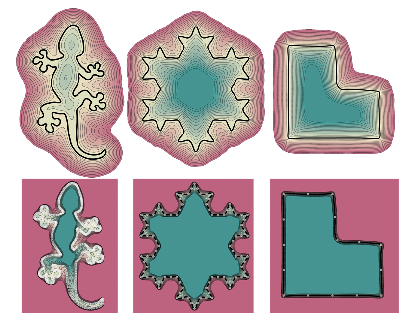
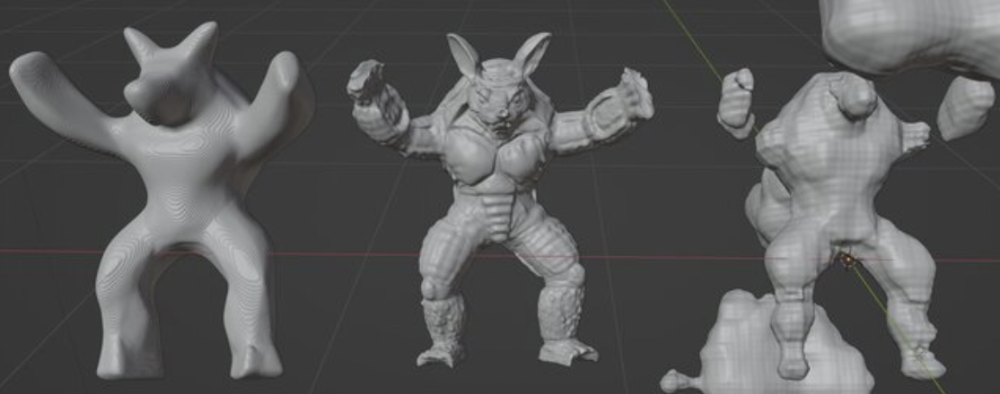

# PHASE-based Implicit Neural Representation
<p align="center">
  
</p>

This repository contains an unofficial implementation to the paper: "Phase Transitions, Distance Functions, and Implicit Neural Representations". It is implemented on top of the [IGR Codebase](https://github.com/amosgropp/IGR).

Representing surfaces as zero level sets of neural networks recently emerged as a powerful modeling paradigm, named Implicit Neural Representations (INRs), serving numerous downstream applications in geometric deep learning and 3D vision. Training INRs previously required choosing between occupancy and distance function representation and different losses with unknown limit behavior and/or bias. In this paper we draw inspiration from the theory of phase transitions of fluids and suggest a loss for training INRs that learns a density function that converges to a proper occupancy function, while its log transform converges to a distance function. Furthermore, we analyze the limit minimizer of this loss showing it satisfies the reconstruction constraints and has minimal surface perimeter, a desirable inductive bias for surface reconstruction. Training INRs with this new loss leads to state-of-the-art reconstructions on a standard benchmark. 

For more details:

- [PHASE Paper](https://arxiv.org/abs/2106.07689)
- [Implementation Paper](https://www.researchgate.net/publication/370214904_Implicit_Neural_Representation_with_PHASE_Implementation)
- [Video](https://www.youtube.com/live/lmjpyIWIsZg?feature=share)

* Changes are made on the IGR Codebase to incorporate phase only at the following files:
  - `reconstruction/run.py`
  - `reconstruction/setup.conf`
  - `model/network.py`
  - `utils/general.py`
  
These changes are included within the following lines in each file:
```python
# PHASE IMPLEMENTATION: START
...
# PHASE IMPLEMENTATION: END
```

## Installation Requirments
The code is compatible with python 3.7 and pytorch 1.2. In addition, the following packages are required:  
```console
pip install numpy scipy pyhocon plotly scikit-image trimesh GPUtil open3d
```

## Usage

### Surface reconstruction
<p align="center">
  
</p>

PHASE-INR can be used to reconstruct a single surface given a point cloud with or without normal data. Adjust `reconstruction/setup.json` to the
path of the input 2D/3D point cloud:
```config
train
{
  ...
  d_in=D
  ...
  input_path = your_path
  ...
}
```
Where D=3 in case we use 3D data or 2 if we use 2D. It supports xyz,npy,npz,ply files.

Additional, hyperparameters can be tweaked in the `reconstruction/setup.json` file.

Then, run training:
```console
cd ./code
python reconstruction/run.py 
```
Finally, to produce the meshed surface, run:
```console
cd ./code
python reconstruction/run.py --eval --checkpoint CHECKPOINT
```
where CHECKPOINT is the epoch you wish to evaluate or skip `--checkpoint CHECKPOINT` to evaluate the 'latest' epoch.

Chamfer Distance is implemented in `utils/general.py` and can be called to evaluate the reconstruction quality of the reconstructed mesh with a target mesh.

Here, is a test run of this inside this [Colab Notebook](https://colab.research.google.com/drive/1I820pN7U0s4oanUC5TIrD7L7sijchl1N?usp=sharing)

### Preliminary Results

Because of computational constraints and availability of only the Colab Enviornment, I could only test it for smaller training duration and network size. (For more details check the [Implementation Paper](https://www.researchgate.net/publication/370214904_Implicit_Neural_Representation_with_PHASE_Implementation)). Below are some preliminary results after just 1000 epochs each for the vanilla PHASE (left), PHASE with Fourier Feature (right) implementation and target mesh (middle)

<p align="center">
  
</p>

## Citation
For citation of this implementation use:
- DOI Link: http://dx.doi.org/10.13140/RG.2.2.33274.98244
    	
## Related papers
* [Lipman et al. - Phase Transitions, Distance Functions, and Implicit Neural Representations](https://arxiv.org/abs/2106.07689)
